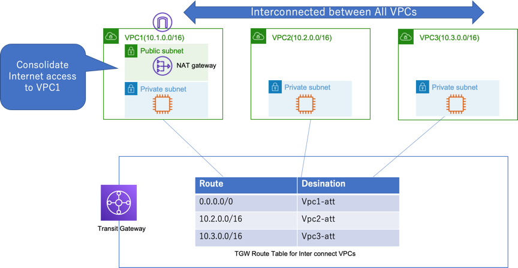
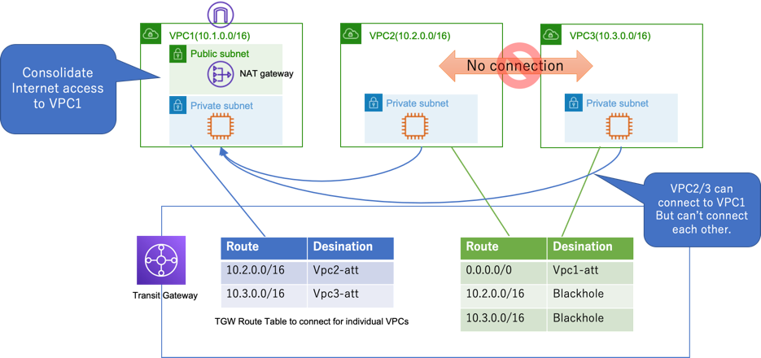

# AWS Transit Gatway Demo 

- Demo1: Multi VPC Interconnect
  - Create a stack using TGW-multi-vpc-interconnect.yaml
- Demo2: Shared VPC for Internet connection (Individual VPCs exclude shared VPC can't connect each other.)
  - Create a stack using TGW-shared-public-vpc

# Demo1: Multi VPC Interconnect Architecture

# Demo2: Shared VPC for Internet connection Architecture

