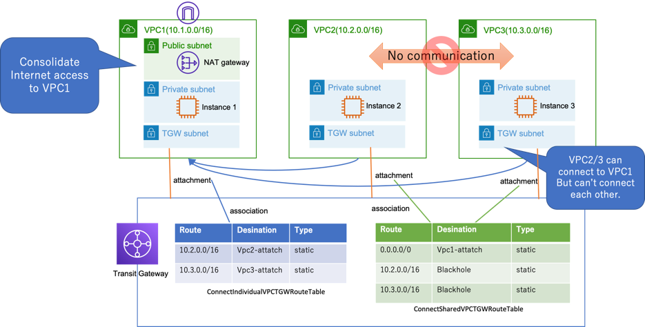
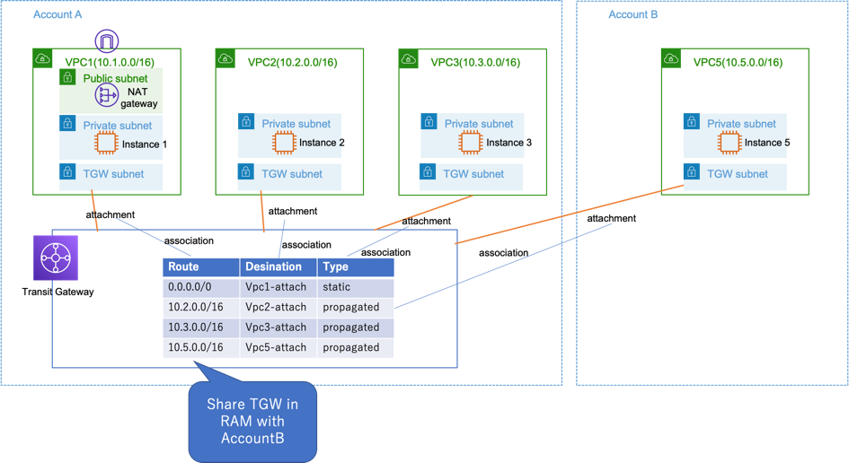
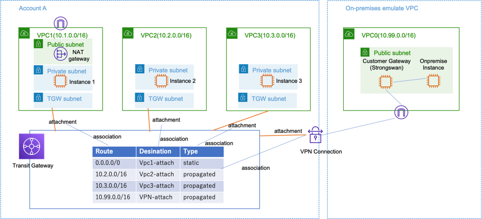

# AWS Transit Gatway Demo 

This is the demo set of AWS Transit Gateway. There are several CFn templates for demos.
The templates support Tokyo region, Singapore region, and Oregon region.

- Demo1: Multi VPC Interconnect
- Demo2: Shared VPC for Internet connection (Individual VPCs exclude shared VPC can't connect each other.)
- Demo3: TGW Peering Inter region connection
- Demo4: TGW Multi-Account Sharing
- Demo5: Site-To-Site VPN with TGW

# Demo1: Multi VPC Interconnect


## How to demo

- Create a stack using templates/Demo1-TGW-multi-vpc-interconnect.yaml in Tokyo region
  ```
  aws cloudformation create-stack --stack-name TGWDemo1 --template-body file://templates/Demo1-TGW-multi-vpc-interconnect.yaml --capabilities CAPABILITY_NAMED_IAM
  aws cloudformation wait stack-create-complete --stack-name TGWDemo1
  ```
- Connect Each Instance by using SSM Session Manager. 
- Ping between each instance to check the connectivity.
- Ping the Internet address on instance 2 or 3 to verify the Internet connectivity.


## Crean Up

- Delete the stacks. Execute the following commands.
  ```
  aws cloudformation delete-stack --stack-name TGWDemo2
  aws cloudformation wait stack-delete-complete --stack-name TGWDemo2
  ```

# Demo2: Shared VPC for Internet connection



## How to demo

- Create a stack using templates/Demo2-TGW-shared-public-vpc.yaml in Tokyo region
  ```
  aws cloudformation create-stack --stack-name TGWDemo2 --template-body file://templates/Demo2-TGW-shared-public-vpc.yaml --capabilities CAPABILITY_NAMED_IAM
  aws cloudformation wait stack-create-complete --stack-name TGWDemo2
  ```
- Connect each Instance by using SSM Session Manager. 
- Ping between Instance 1 and Instance2 / Instance3 to check the connectivity.
- Ping the Internet address on instance 2 / 3 to verify the connectivity to the Internet.
- Ping between Instance 2 and Instance 3 to verify that these can't communicate with each other. 

## Crean Up

- Delete the stacks. Execute the following commands.
  ```
  aws cloudformation delete-stack --stack-name TGWDemo2
  aws cloudformation wait stack-delete-complete --stack-name TGWDemo2
  ```

# Demo3: TGW Peering Inter region connection


## How to demo

- Create a stack using templates/Demo1-TGW-multi-vpc-interconnect.yaml in Tokyo region (If you did not create it)
  ```
  aws cloudformation create-stack --stack-name TGWDemo1 --template-body file://templates/Demo1-TGW-multi-vpc-interconnect.yaml --capabilities CAPABILITY_NAMED_IAM
  aws cloudformation wait stack-create-complete --stack-name TGWDemo1
  ```
- Create a stack using templates/Demo3-TGW-remote-region-tgw-for-peering.yaml in Oregon or Singapore region
  ```
  aws cloudformation create-stack --stack-name TGWDemo3 --template-body file://templates/Demo3-TGW-remote-region-tgw-for-peering.yaml --capabilities CAPABILITY_NAMED_IAM
  aws cloudformation wait stack-create-complete --stack-name TGWDemo3
  ```
- In VPC Service console, Create an attachment with the type of peering connection between Tokyo region's tgw and the other region's tgw
- Accept the peering attachment in the other region. Then the status will change from pending to available in about 10 minutes.
- In the TGW Route table of each region, associate the peering atachment to TGW Route table.
- In the TGW Route table of each region, define each other's route as static routes.
  - In Tokyo region: add a route (cidr 10.4.0.0/16 -> peering attachment)
  - In the other region: add a route (cidr 0.0.0.0/0 -> peering attachment)
- Ping from Instance 4 to Instance 1 to verify that these can communicate with each other. 
- Ping from the Internet address on instance 4 to verify that the instance can connect to the Internet.

## Crean Up

- Delete the TGW Peering attachment in Management Console.
- Delete the stacks. Execute the following commands.
  ```
  aws cloudformation delete-stack --stack-name TGWDemo3
  aws cloudformation wait stack-delete-complete --stack-name TGWDemo3

  aws cloudformation delete-stack --stack-name TGWDemo1
  aws cloudformation wait stack-delete-complete --stack-name TGWDemo1
  ```

# Demo4: TGW Multi-Account Sharing



## How to demo

- Create a stack using Demo1-TGW-multi-vpc-interconnect.yaml in Tokyo region (If you haven't created it yet.)
  ```
  aws cloudformation create-stack --stack-name TGWDemo1 --template-body file://templates/Demo1-TGW-multi-vpc-interconnect.yaml --capabilities CAPABILITY_NAMED_IAM
  aws cloudformation wait stack-create-complete --stack-name TGWDemo1
  ```

- Create a TGW resource share in Resource Access Manager(RAM) console and share the TGW with the other AWS accounts. Then make a note of the TGW ID.
- Create a stack in tokyo region of **the other AWS account** using templates/Demo4-TGW-remote-region-tgw-for-peering.yaml. Specify the TGW ID in the argument.
  ```
  aws cloudformation create-stack --stack-name TGWDemo4 --template-body file://templates/Demo4-TGW-remote-region-tgw-for-peering.yaml \
      --parameters \
      ParameterKey=SharedTGWID,ParameterValue="REPLACE_YOUR_TGW_ID" \
      --capabilities CAPABILITY_NAMED_IAM
  aws cloudformation wait stack-create-complete --stack-name TGWDemo4
  ```
- In the original account, check the TGW attachment added by the other account is available. (Since the "Auto accept shared attachments" attribute of TGW is true, attachments added by other accounts will be automatically available.)
- In the original account, associate the added attachment in another account with the TGW Route Table.
- In the original account, create propagation for the association with the TGW Route Table.
- Ping from Instance1 to Instance5 that is in the other account.

## Crean Up

- Delete a TGW resource share in Resource Access Manager(RAM) console
- Delete the stacks. Execute the following commands.
  ```
  aws cloudformation delete-stack --stack-name TGWDemo3
  aws cloudformation wait stack-delete-complete --stack-name TGWDemo3

  aws cloudformation delete-stack --stack-name TGWDemo1
  aws cloudformation wait stack-delete-complete --stack-name TGWDemo1
  ```

# Demo5: Site-To-Site VPN with TGW



- You can demonstrate the contents of the following URL.
  - [Example: Centralized router - Amazon Virtual Private Cloud](https://docs.aws.amazon.com/vpc/latest/tgw/transit-gateway-centralized-router.html#transit-gateway-centralized-router-resources)

## How to demo

- Create a stack using templates/Demo1-TGW-multi-vpc-interconnect.yaml in Tokyo region (If you did not create it)
  ```
  aws cloudformation create-stack --stack-name TGWDemo1 --template-body file://templates/Demo1-TGW-multi-vpc-interconnect.yaml --capabilities CAPABILITY_NAMED_IAM
  aws cloudformation wait stack-create-complete --stack-name TGWDemo1
  ```
- Create a stack using templates/Demo5-TGW-site-to-site-vpn.yaml in Oregon or Singapore region
  ```
  aws cloudformation create-stack --stack-name TGWDemo5 --template-body file://templates/Demo5-TGW-site-to-site-vpn.yaml --capabilities CAPABILITY_NAMED_IAM
  aws cloudformation wait stack-create-complete --stack-name TGWDemo5
  ```
- After the stack is created, execute the following command to start the EC2 instance that will serve as the virtual router by Strongswan.
  ```
  ./create-strongswan.sh
  aws cloudformation wait stack-create-complete --stack-name TGWDemo-strongswan
  ```
- Connect Each Instance by using SSM Session Manager. 
- Ping between Instance 1 / Instance2 / Instance3 and OnpreWebInstance that has been created By TGWDemo5 stack to check the connectivity 

## All command list

```
aws cloudformation create-stack --stack-name TGWDemo1 --template-body file://templates/Demo1-TGW-multi-vpc-interconnect.yaml --capabilities CAPABILITY_NAMED_IAM
aws cloudformation wait stack-create-complete --stack-name TGWDemo1

aws cloudformation create-stack --stack-name TGWDemo5 --template-body file://templates/Demo5-TGW-site-to-site-vpn.yaml --capabilities CAPABILITY_NAMED_IAM
aws cloudformation wait stack-create-complete --stack-name TGWDemo5

./create-strongswan.sh
aws cloudformation wait stack-create-complete --stack-name TGWDemo-strongswan

```

## Crean Up

- Delete the stacks. Execute the following commands.
  ```
  aws cloudformation delete-stack --stack-name TGWDemo-strongswan
  aws cloudformation wait stack-delete-complete --stack-name TGWDemo-strongswan

  aws cloudformation delete-stack --stack-name TGWDemo5
  aws cloudformation wait stack-delete-complete --stack-name TGWDemo5

  aws cloudformation delete-stack --stack-name TGWDemo1
  aws cloudformation wait stack-delete-complete --stack-name TGWDemo1
  ```
