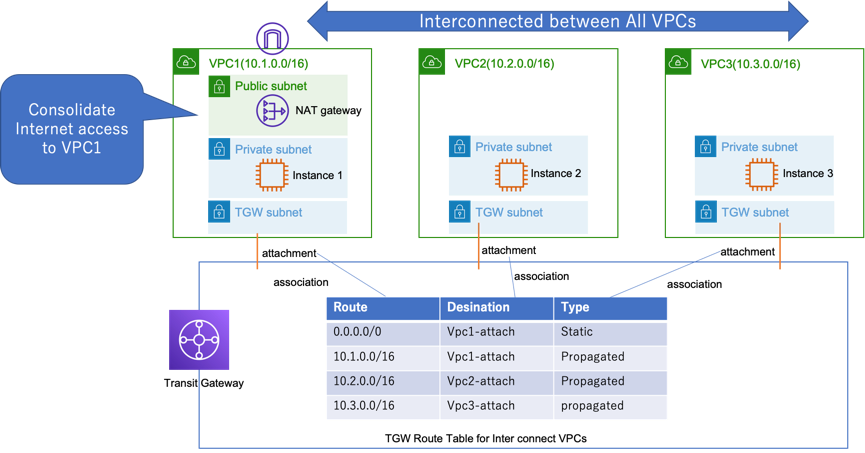
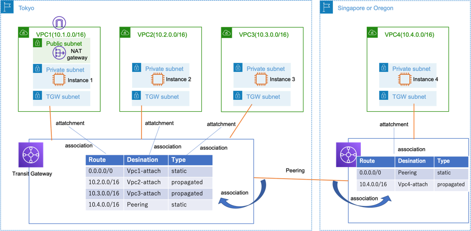

# AWS Transit Gatway Demo 

This is the demo of AWS Transit Gateway. There are sevral CFn templates for demos.
The templates support Tokyo region, Singapore region, and Oregon region.

- Demo1: Multi VPC Interconnect Demo
- Demo2: Shared VPC for Internet connection (Individual VPCs exclude shared VPC can't connect each other.)
- Demo3: TGW Peering Inter region connection demo
- Demo4: TGW Multi Account Sharing demo

# Demo1: Multi VPC Interconnect Architecture

## How to demo

- Step1: Create a stack using Demo1-TGW-multi-vpc-interconnect.yaml in Tokyo region
- Step2: Connect Each Instance by using SSM Session Manager. 
- Step3: Ping to check the connectivity between each instances. 
- Step4: Ping the Internet address on instance 2 or 3 to verify that you can connect to the Internet.

# Demo2: Shared VPC for Internet connection Architecture

## How to demo

- Step1: Create a stack using Demo2-TGW-shared-public-vpc.yaml in Tokyo region
- Step2: Connect Each Instance by using SSM Session Manager. 
- Step3: Ping to check the connectivity between Instance 1 and Instance2 or Instance3. 
- Step4: Ping the Internet address on instance 2 or 3 to verify that you can connect to the Internet.
- Step5: Ping between Instance 2 and Instance 3 to confirm that it cannot communicate with each other. 

# Demo3: TGW Peering Inter region connection demo

## How to demo

- Step1: Create a stack using Demo1-TGW-multi-vpc-interconnect.yaml in Tokyo region (If you did not create it)
- Step2: Create a stack using Demo3-TGW-remote-region-tgw-for-peering.yaml in Oregon or Singapore region
- Step3: Create TGW Peering Connection Attachment between Tokyo region's tgw and the other region's tgw using Management Console
- Step4: Accept the peering attachment in the other region. Then the status changes from pending to available in about 10 minutes.
- Step5: In the TGW Route table of each region, associate the peering atachment to TGW Route table.
- Step6: In the TGW Route table of each region, define each other's routes as static routes.
  - In Tokyo region: add a route (cidr 10.4.0.0/16 -> peering attachment)
  - In the other region: add a route (cidr 0.0.0.0/0 -> peering attachment)
- Step7: Ping between Instance 4 and Instance 1 to confirm that it can communicate with each other. 
- Step8: Ping the Internet address on instance 4 in the other region to verify that you can connect to the Internet.

# Demo4: TGW Multi Account Sharing demo

## How to demo

- Step1: Create a stack using Demo1-TGW-multi-vpc-interconnect.yaml in Tokyo region (If you did not create it)
- Step2: Create a TGW resource share in RAM and share the TGW with other AWS accounts. Then make a note of your TGW ID.
- Step3: Create a stack in the Tokyo region of another AWS account using Demo4-TGW-remote-region-tgw-for-peering.yaml. Specify the TGW ID in the argument.
- Step4: In the original account, check the TGW Attachment added by the other account is available. (Since the "Auto accept shared attachments" attribute of TGW is enabled, attachments added by other accounts will be automatically available.)
- Step5: In the original account, associate the added Attachment with the TGW Route Table.
- Step6: In the original account, create propagetion for the added Attachment with the TGW Route Table.
- Step7: Ping from Instance1 to Instance5 that is in other account.
